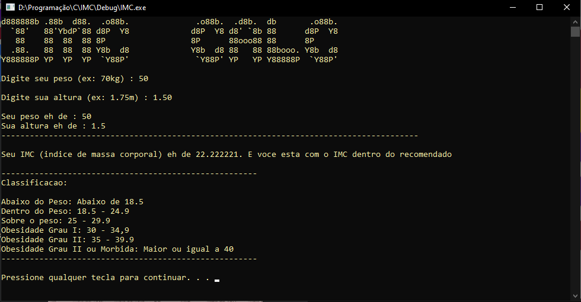
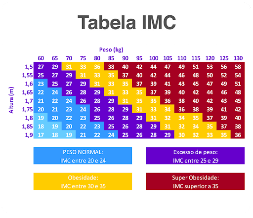

# Calculadora de IMC
Fiz um programa em C que calcula um IMC (Índice de Massa Corporal) a partir de duas variáveis (peso e altura).
Utilizei a lib da Math.h para poder fazer a formula do IMC.

# Fórmula do IMC
IMC = Peso dividido pela altura ao quadrado
<b>peso / (pow(altura, 2));<b>

